# Edge LMS Django React

Edge LMS is a Learning Management System built using Django for the backend and React for the frontend. This project aims to provide a comprehensive platform for managing and delivering educational courses online.

## Features

- User authentication and authorization
- Course creation, View, Course Details
- Module Assign to course
- Instructor Assign to course
- Enrollment and progress tracking (Upcoming)
- Interactive quizzes and assignments (Upcoming)
- Real-time notifications (Upcoming)
- Responsive design (Upcoming)

## Technologies Used

- **Backend:** Django, Django REST Framework
- **Frontend:** React, react-router-dom, Axios, Tailwind CSS, Shadcn/UI,
- **Database:** PostgreSQL, SQLite3
- **Deployment:**

## Installation

### Step 1: Clone the repository

git clone https://github.com/dsujoydev/edge-lms-django-react.git

### Step 2: Navigate to the backend folder

cd backend

### Step 3: Install Python dependencies

pip install -r requirements.txt

### Step 4: Start the Django development server

python manage.py runserver

### Step 5: Navigate back to the project root

cd -

### Step 6: Navigate to the frontend folder

cd frontend

### Step 7: Install frontend dependencies

pnpm install

### Step 8: Start the React development server

pnpm run dev

## Contact

For any inquiries, please contact us at [dsujoy.cse@gmail.com](mailto:dsujoy.cse@gmail.com).

## Screenshots

### Postman API Testing

Here are some screenshots showing how the APIs are tested using Postman:

<!-- ### Frontend Interface

Below are some screenshots of the frontend interface demonstrating the API integration:

 -->

### User Registration API

#### URL

`http://127.0.0.1:8000/api/users/register/`

#### Method

`POST`

#### Description

This endpoint is used to register a new user in the system.

#### Payload

```json
{
  "username": "testuser",
  "email": "testuser@gmail.com",
  "password": "12345",
  "first_name": "test",
  "last_name": "user",
  "user_type": "admin",
  "bio": "I am a test user"
}
```

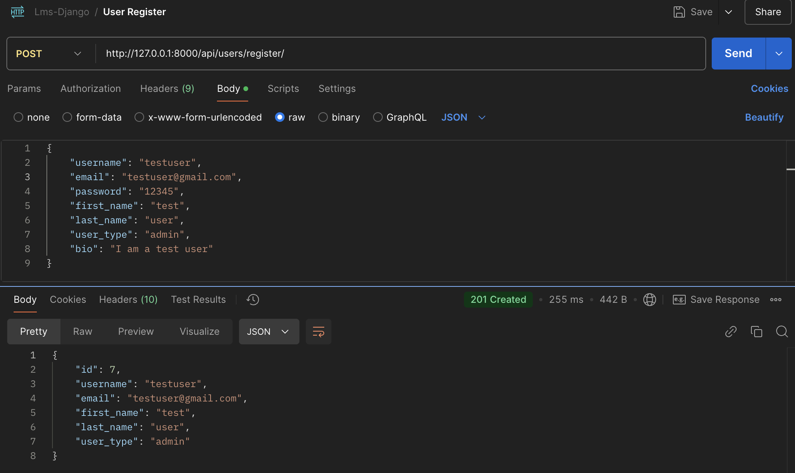
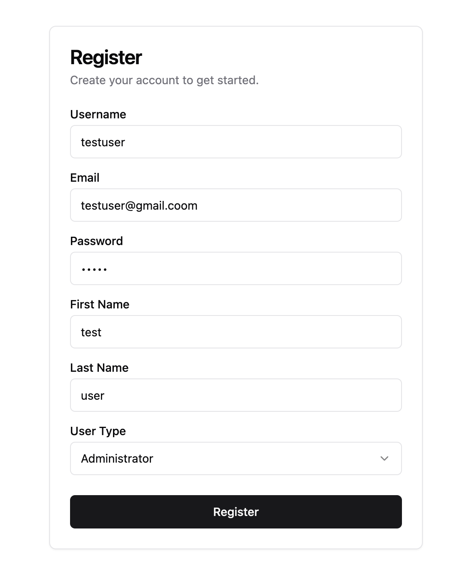

### User Token API

#### URL

`http://127.0.0.1:8000/api/users/token/`

#### Method

`POST`

#### Description

This endpoint is used to obtain a token for an authenticated user.

#### Payload

```json
{
  "username": "testuser",
  "password": "12345"
}
```

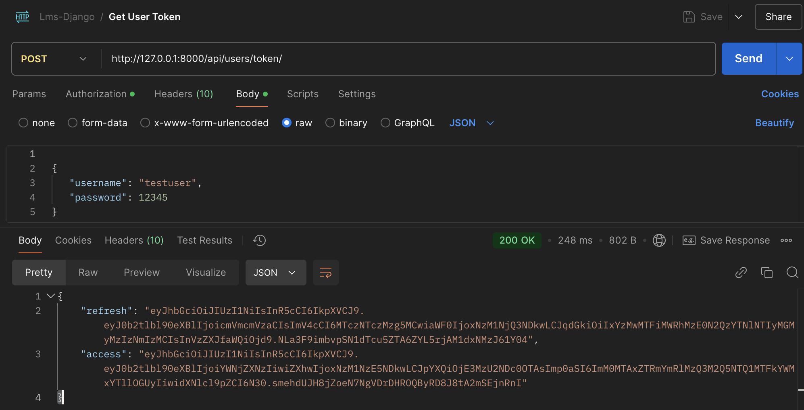


### Token Refresh API

#### URL

`http://127.0.0.1:8000/api/users/token/refresh/`

#### Method

`POST`

#### Description

This endpoint is used to refresh an existing token.

#### Payload

```json
{
  "username": "testuser",
  "password": "12345"
}
```

### User Profile API

#### URL

`http://127.0.0.1:8000/api/users/profile/`

#### Method

`GET`

#### Description

This endpoint returns the profile of the logged-in user.

#### Response

```json
{
  "id": 7,
  "username": "testuser",
  "email": "testuser@gmail.com",
  "first_name": "test",
  "last_name": "user",
  "user_type": "admin",
  "bio": ""
}
```

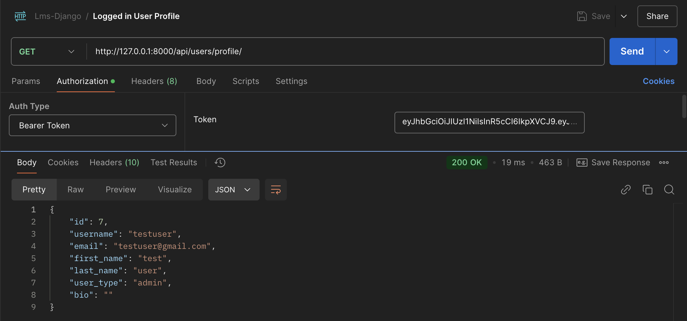
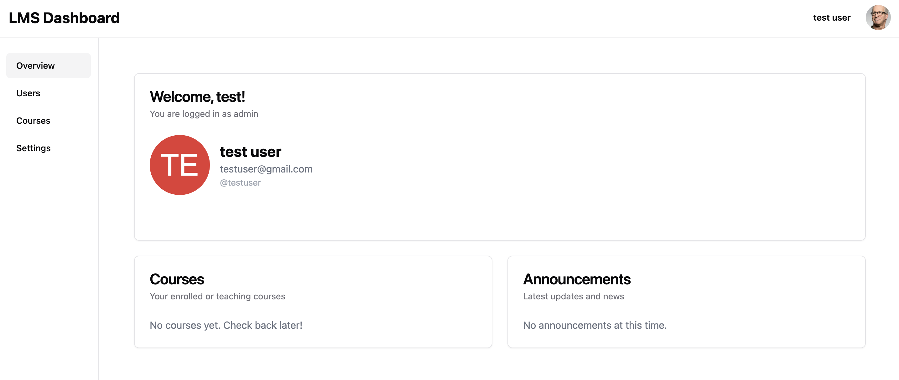

### User List API

#### URL

`http://127.0.0.1:8000/api/users/list/`

#### Method

`GET`

#### Description

This endpoint returns a list of all registered users.

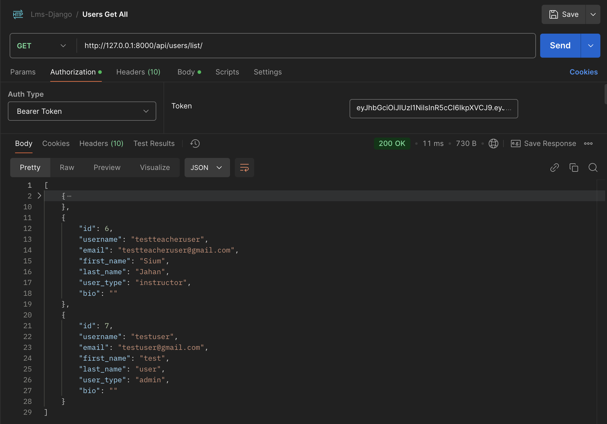
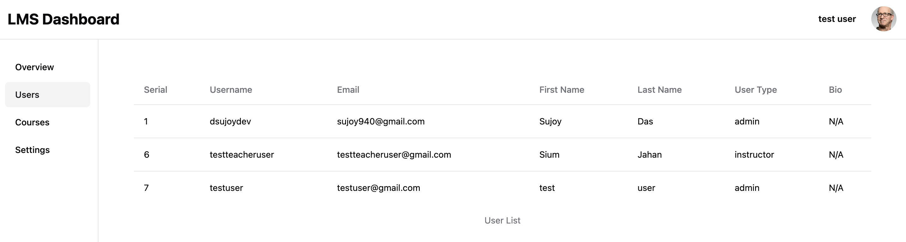

### Course Registration API

#### URL

`http://127.0.0.1:8000/api/courses/`

#### Method

`POST`

#### Description

This endpoint is used to register a new course.

#### Payload

```json
{
  "course_code": "FE201",
  "title": "Modern React Development",
  "description": "Master React 18 through hands-on projects. Topics include component architecture, hooks, state management, React Router, API integration, and modern React patterns. Students will build real-world applications using Next.js, TypeScript, and popular React libraries like Tailwind CSS and shadcn/ui.",
  "short_description": "Learn modern React development and best practices",
  "is_active": true,
  "start_date": "2024-01-10",
  "end_date": "2024-04-10",
  "max_students": 30
}
```

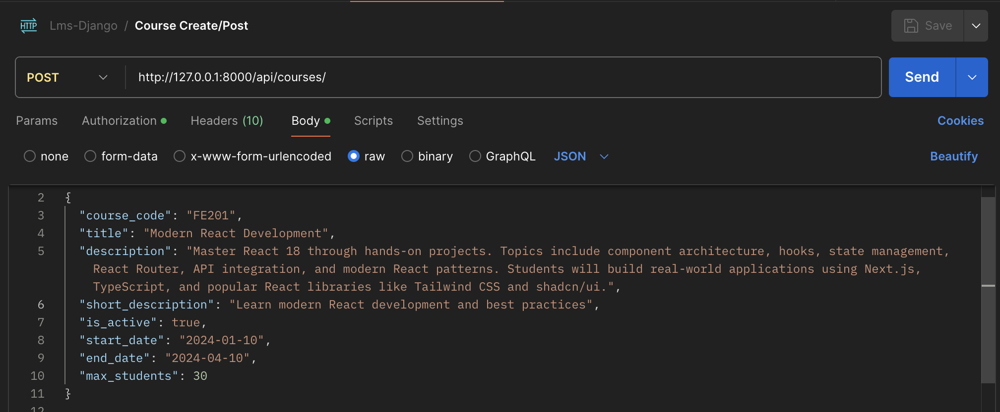
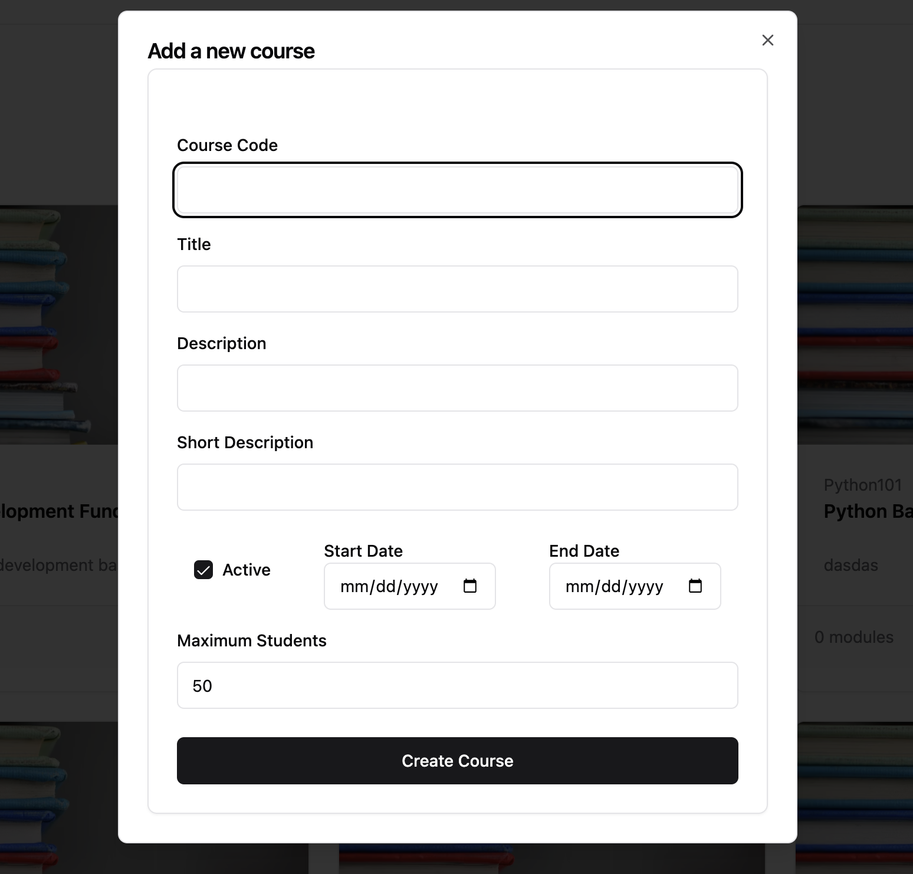

### Course List API

#### URL

`http://127.0.0.1:8000/api/courses/`

#### Method

`GET`

#### Description

This endpoint returns a list of all courses.

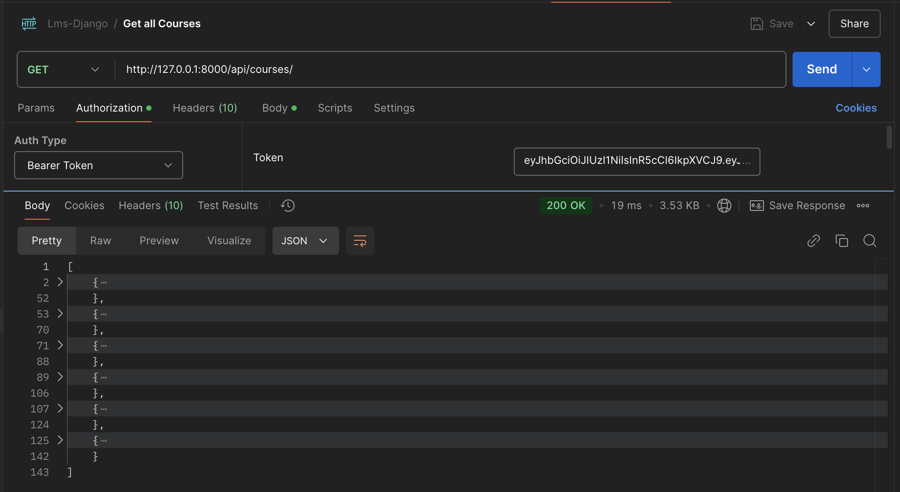
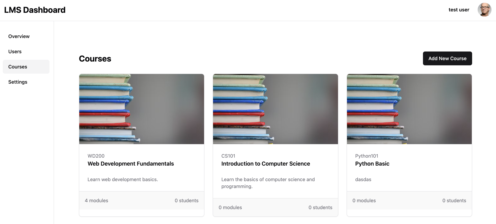

### Single Course API

#### URL

`http://127.0.0.1:8000/api/courses/:id/`

#### Method

`GET`

#### Description

This endpoint returns details of a single course.

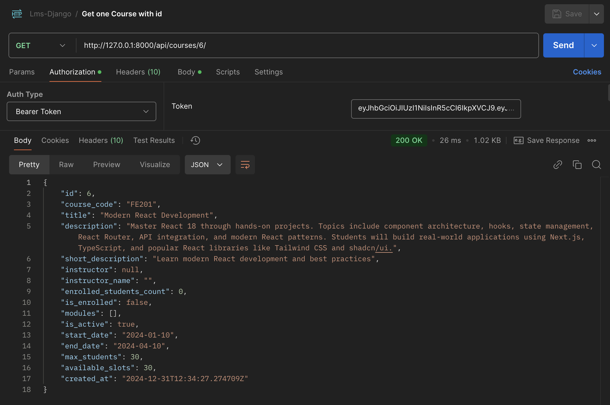
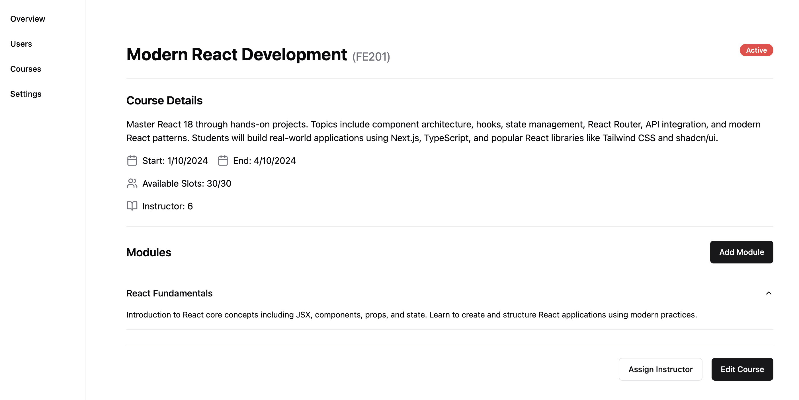

### Module Creation API

#### URL

`http://127.0.0.1:8000/api/modules/`

#### Method

`POST`

#### Description

This endpoint is used to create a new module for a course.

#### Payload

```json
{
  "course_id": 6,
  "title": "React Fundamentals",
  "description": "Introduction to React core concepts including JSX, components, props, and state. Learn to create and structure React applications using modern practices."
}
```

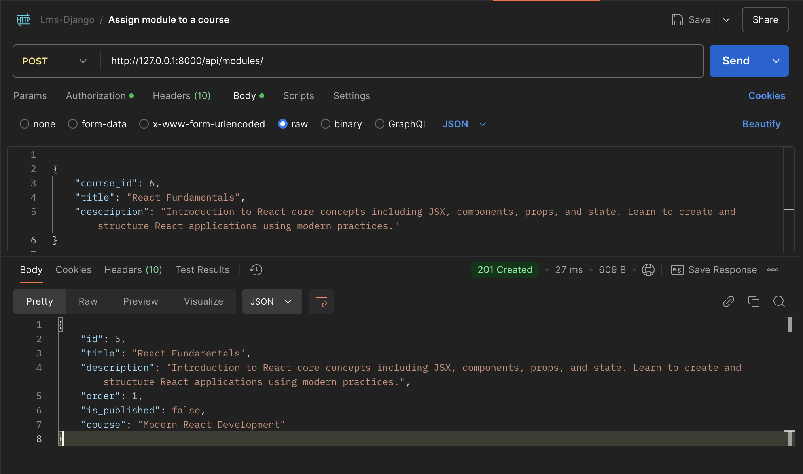
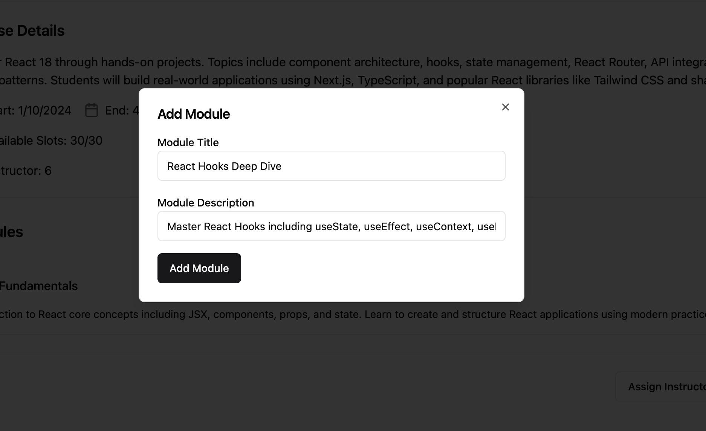

### Assign Instructor API

#### URL

`http://127.0.0.1:8000/api/courses/6/assign-instructor/`

#### Method

`POST`

#### Description

This endpoint is used to assign an instructor to a course.

#### Payload

```json
{
  "instructor_id": 6
}
```

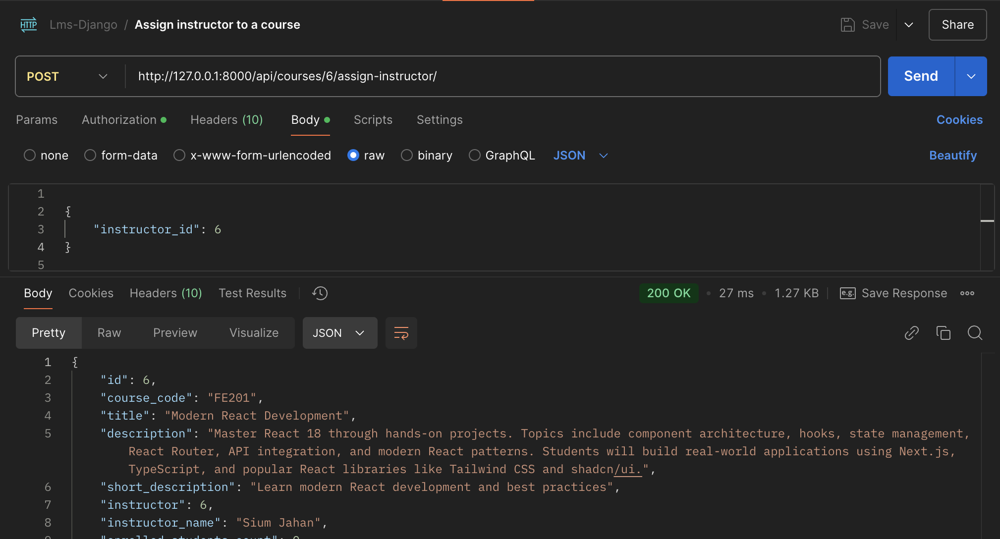
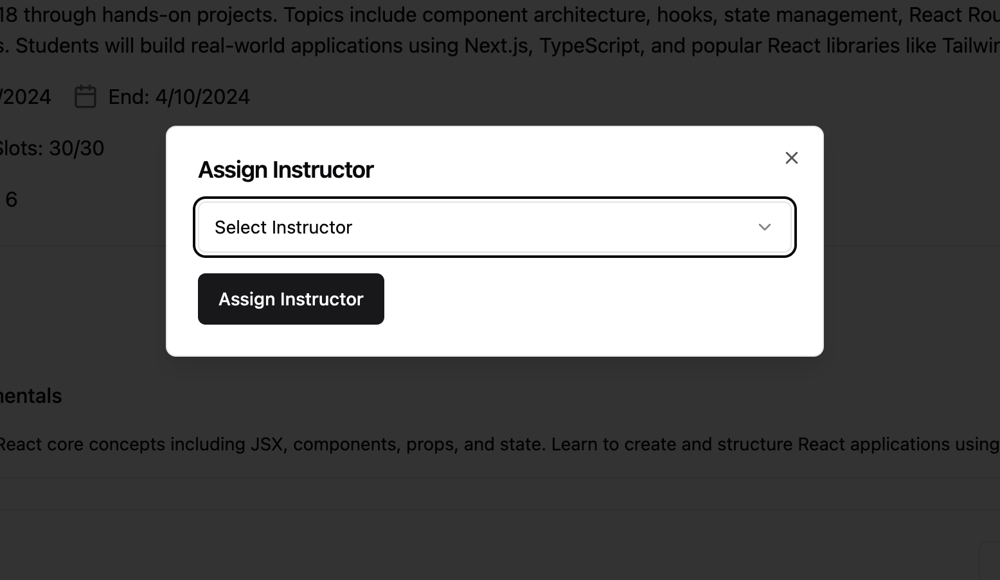

### Delete Course API

#### URL

`http://127.0.0.1:8000/api/courses/3/`

#### Method

`DELETE`

#### Description

This endpoint is used to delete a course.
